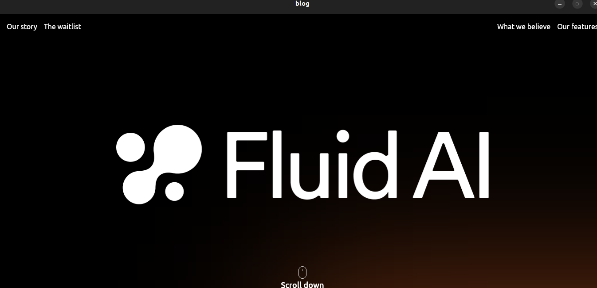

# Fluid AI App

Fluid AI is a Flutter application designed to simplify, organize, and enhance your daily tasks. The app combines advanced AI technology with a user-friendly interface, integrating to-do lists, chats, saved items, and bucket lists into one seamless platform.

## Features

- **Smooth Scrolling**: The app allows for easy navigation through the content with a smooth scrolling experience.
- **Image Carousel**: A horizontal carousel displays images dynamically, enhancing user engagement.
- **Responsive Design**: The layout adapts to different screen sizes, ensuring a consistent user experience across devices.

## Screenshots

Here are some sample screenshots of the app:

| Home Screen                  | Image animate                 |
|------------------------------|--------------------------------|
|  |  |

## Getting Started

### Prerequisites

- Flutter SDK (version x.x.x)
- Dart SDK (version x.x.x)
- An IDE (e.g., Android Studio, Visual Studio Code)

### Installation

1. **Clone the repository**:

   ```bash
   git clone https://github.com/sireat/blog.git
   cd blog
   ```

2. **Install dependencies**:

   ```bash
   flutter pub get
   ```

3. **Run the app**:

   ```bash
   flutter run
   ```

### Usage

- Launch the app on your desired device or emulator.
- Navigate through the home screen to explore the features.
- Interact with the image carousel to view different images and content.

## Contributing

Contributions are welcome! If you'd like to contribute to this project, please follow these steps:

1. Fork the repository.
2. Create a new branch for your feature or bug fix.
3. Commit your changes.
4. Push to the branch.
5. Open a pull request.

## Acknowledgments

- Flutter and Dart for the amazing framework and language.
- Icons and images sourced from [Your Source].
- Inspiration and feedback from the community.
